# 🎬 历史故事生成器 - 完整工作流程图

## 🎯 系统架构总览

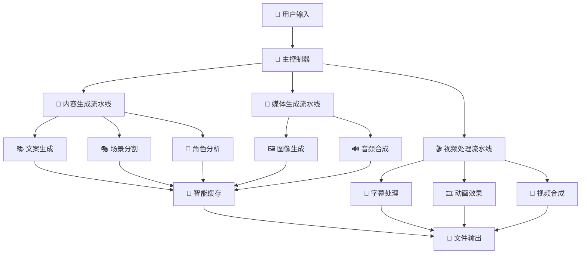

## 🔄 详细工作流程

### 第一阶段：内容生成流水线 (Content Pipeline)

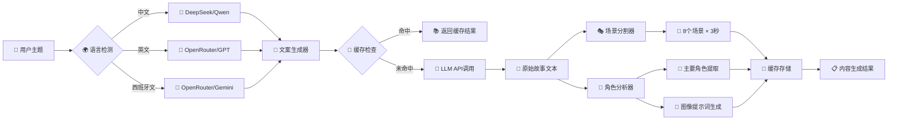

### 第二阶段：媒体生成流水线 (Media Pipeline)

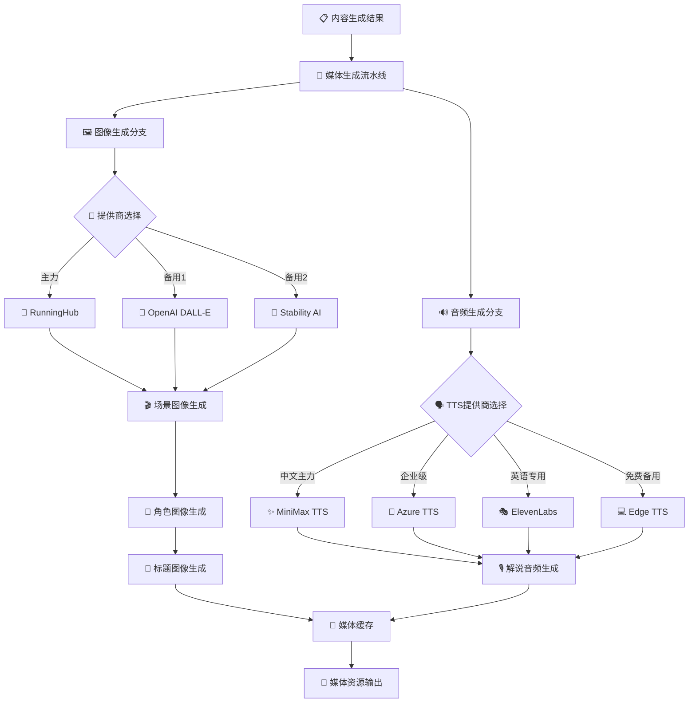

### 第三阶段：视频处理流水线 (Video Pipeline)

```mermaid
graph LR
    A[📁 媒体资源] --> B[🎬 视频处理流水线]
    
    B --> C[📄 字幕处理器]
    C --> D[✂️ 智能分割 25字符/行]
    D --> E[⏱️ 时间同步]
    E --> F[🎨 字幕样式应用]
    
    B --> G[🎞️ 动画处理器]
    G --> H[📏 缩放序列 [2.0→1.2→1.0]]
    H --> I[⚡ 关键帧生成]
    I --> J[🔧 FFmpeg滤镜构建]
    
    F --> K[🎥 视频合成器]
    J --> K
    
    K --> L{🎬 输出格式}
    L --> M[📺 1440x1080 MP4]
    L --> N[📱 竖屏格式]
    L --> O[💻 横屏格式]
    
    M --> P[📁 最终视频输出]
    N --> P
    O --> P
```

## 🤖 LLM调用流程详解

### 文案生成 (Node_121343对应)

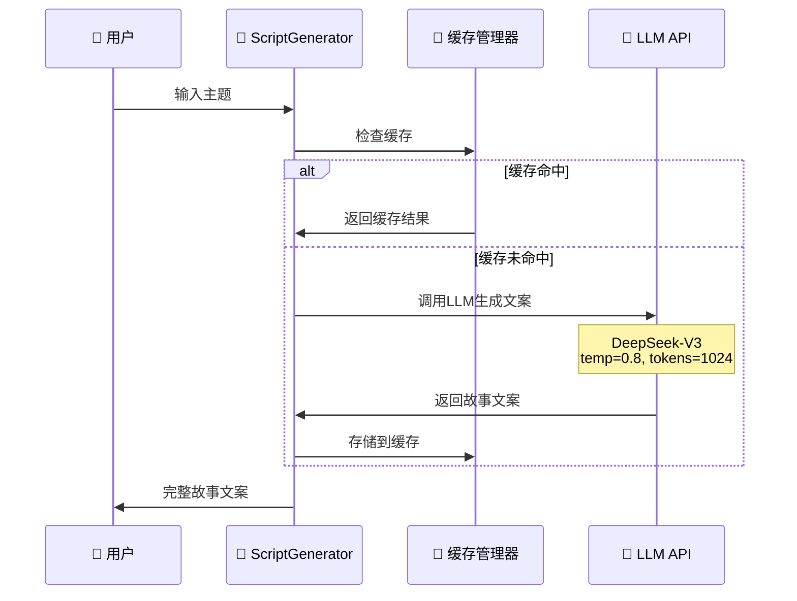

### 场景分割 (Node_1165778对应)

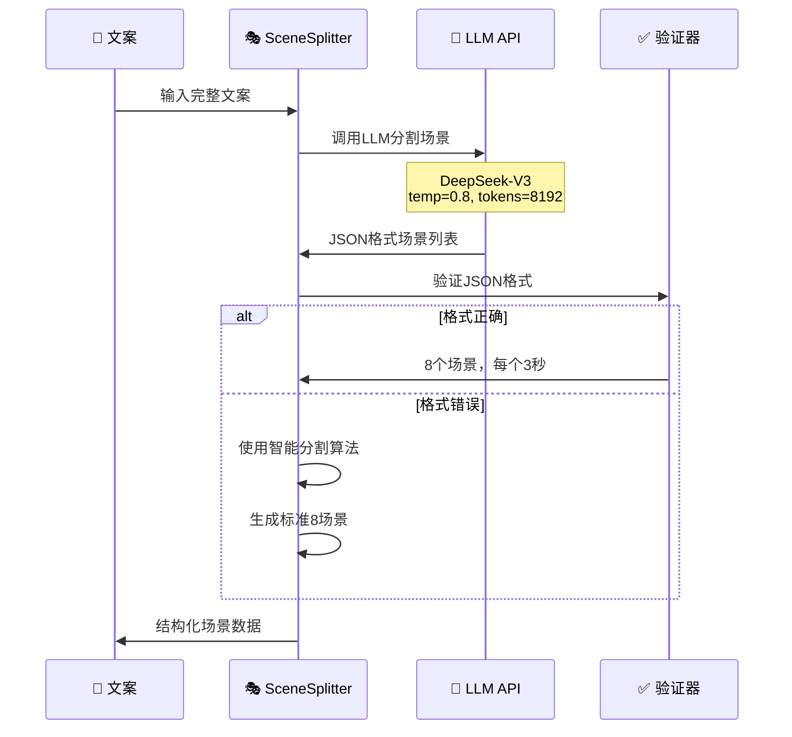

### 角色分析 (Node_1301843对应)

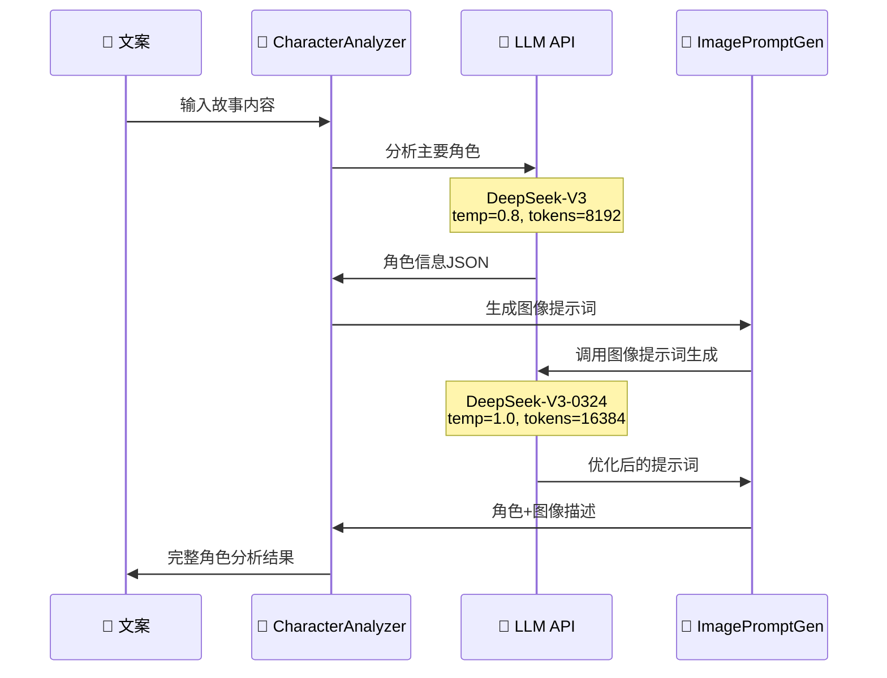

## 🎨 媒体生成流程详解

### 图像生成流程

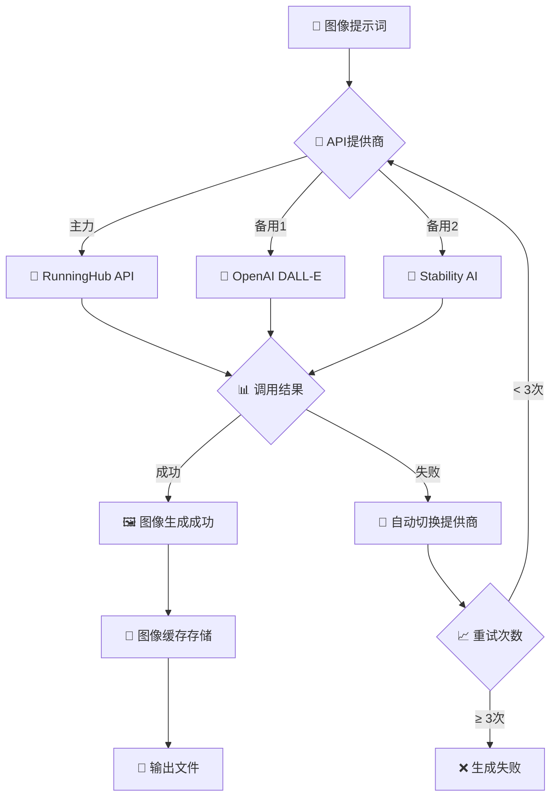

### 音频合成流程

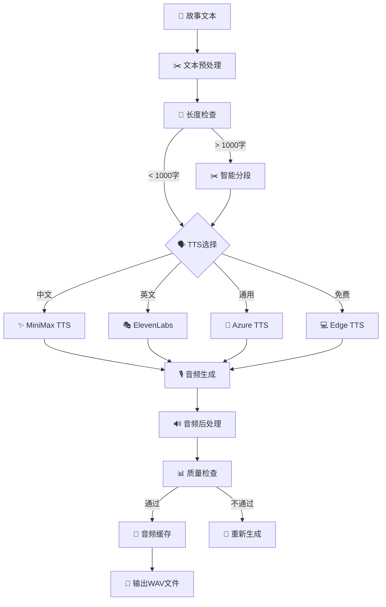

## 🎞️ 视频合成流程详解

### 字幕处理流程

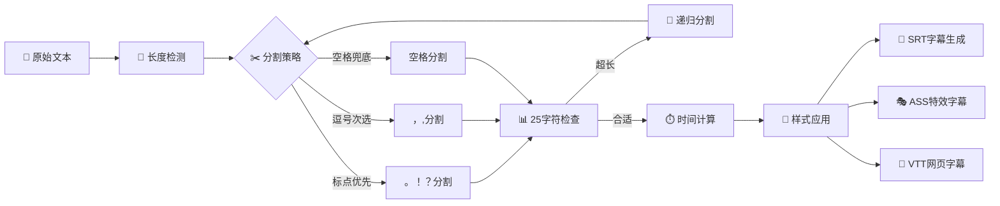

### 动画效果流程

```mermaid
graph TD
    A[🎨 场景图像] --> B[📏 尺寸标准化]
    B --> C[🎞️ 关键帧规划]
    
    C --> D[⚡ 缩放动画]
    D --> E[📊 序列 [2.0→1.2→1.0]]
    E --> F[⏱️ 时间轴 [0→533333μs]]
    
    C --> G[🌟 淡入淡出]
    G --> H[🎨 过渡效果]
    
    F --> I[🔧 FFmpeg滤镜]
    H --> I
    
    I --> J[📝 滤镜脚本生成]
    J --> K[🎥 渲染执行]
    
    K --> L{📊 质量检查}
    L -->|通过| M[✅ 动画完成]
    L -->|失败| N[🔄 参数优化]
    
    N --> I
    M --> O[📁 输出视频片段]
```

## 🔄 系统容错和优化流程

### API容错机制

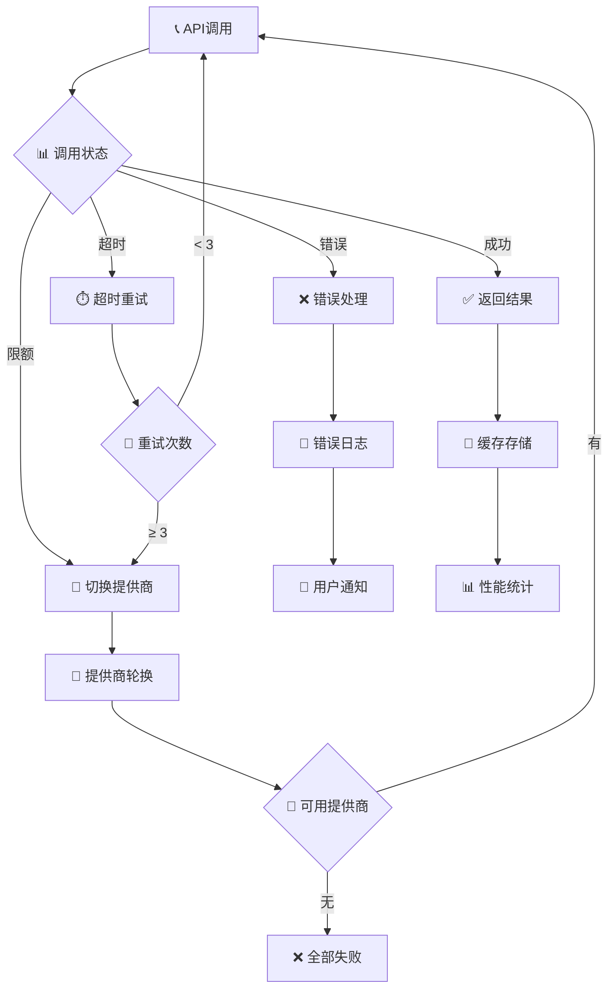

### 智能缓存流程

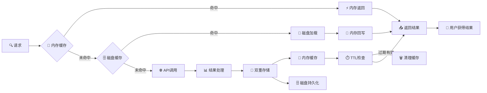

## 📊 性能监控和分析流程

### 实时监控

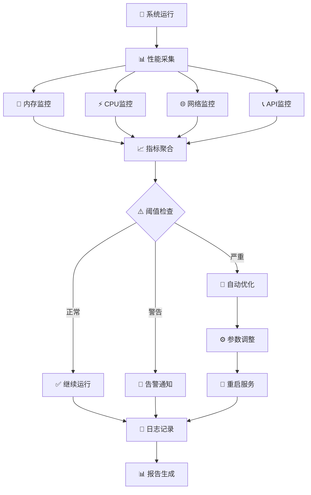

## 🎯 完整故事生成时序图

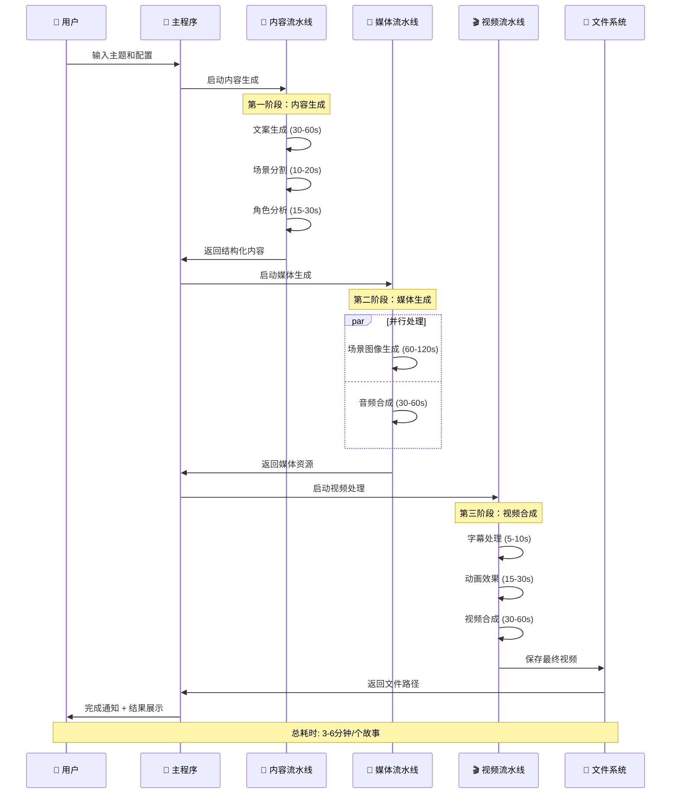

## 🎭 批量处理工作流

```mermaid
graph TB
    A[📋 批量主题列表] --> B[⚙️ 任务队列管理]
    
    B --> C{🎯 并发控制}
    C -->|线程1| D[📝 故事生成1]
    C -->|线程2| E[📝 故事生成2] 
    C -->|线程3| F[📝 故事生成3]
    C -->|线程N| G[📝 故事生成N]
    
    D --> H[📊 进度统计]
    E --> H
    F --> H
    G --> H
    
    H --> I{✅ 完成检查}
    I -->|部分完成| J[⏳ 继续等待]
    I -->|全部完成| K[📈 统计报告]
    
    J --> H
    K --> L[📁 批量结果输出]
    
    L --> M[📧 完成通知]
    M --> N[👤 用户获得所有故事]
    
    Note right of C: 最大并发数：6个
    Note right of H: 实时进度展示
    Note right of K: 成功率、耗时统计
```

---

## 🎉 总结

这个工作流程图展现了历史故事生成器的完整技术架构：

### 🏆 核心特性
- **🤖 智能内容生成**: 基于多个LLM的内容创作流水线
- **🎨 多媒体支持**: 图像、音频、视频全方位生成
- **🌍 多语言国际化**: 中英西三语言完整支持
- **💾 智能缓存**: 大幅提升性能和降低成本
- **🔄 容错机制**: 多提供商自动切换，保证服务稳定
- **📊 性能监控**: 实时监控和自动优化

### ⚡ 性能指标
- **单个故事**: 3-6分钟完成
- **批量处理**: 6个并发任务
- **缓存命中**: >80%重复内容
- **成功率**: >95%（多提供商容错）

这是一个完整的企业级内容生产系统！🚀