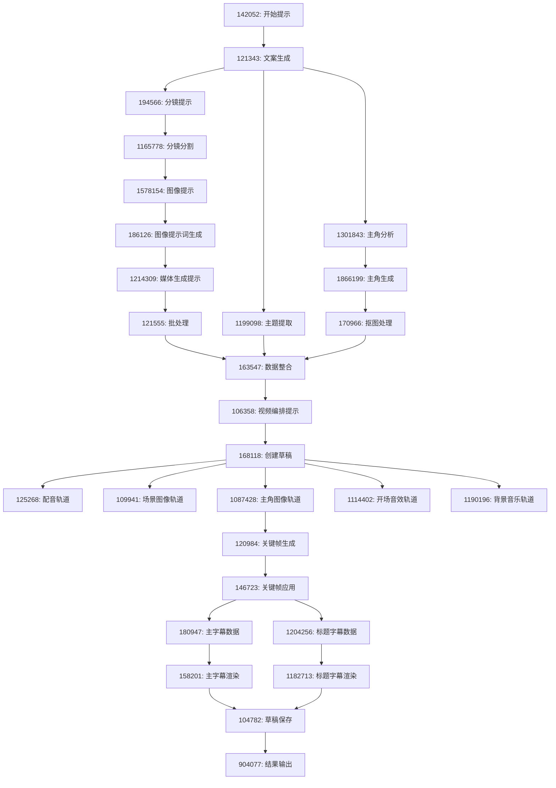

# 沉浸式历史故事工作流 - 结构化文档

## 工作流基本信息

- **工作流名称**: 沉浸式历史故事
- **节点总数**: 28个
- **主要功能**: 从主题输入到视频输出的全自动化历史故事生成
- **输出格式**: 剪映草稿 + 完整视频

---

## 节点详细配置

### 📝 1. 内容生成层

#### Node_121343: 文案生成器
```yaml
类型: LLM节点 (type: 3)
模型: DeepSeek-V3 (ID: 1738675210)
温度: 0.8
最大Token: 1024
功能: 根据主题生成1000字历史故事文案

系统提示词:
  角色: 专业历史故事创作者
  结构要求:
    - 悬念开场 (100字): 疑问句开头制造悬念
    - 身份代入 (200字): 第二人称"你"让观众代入
    - 冲突升级 (300字): 描述历史事件核心矛盾
    - 破局细节 (300字): 揭示关键转折点细节
    - 主题收尾 (100字): 点明历史意义
  
  写作要求:
    - 大量感官描写(视觉、听觉、触觉)
    - 多用短句营造紧张节奏
    - 每段不超过3句话
    - 加入历史专业术语
    - 情感渲染到位

输入: {{主题}}
输出: 完整历史故事文案
```

#### Node_1199098: 主题提取器
```yaml
类型: LLM节点 (type: 3)
模型: DeepSeek-V3 (ID: 1738675210)
温度: 1.0
最大Token: 512
功能: 从文案中提取2个字的核心主题

提示词: |
  从历史故事中提取最核心的主题，生成一个2个字的标题。
  要求：
  1. 必须是2个汉字
  2. 概括故事核心主题
  3. 朗朗上口，有视觉冲击力
  4. 例如：赤壁、长城、变法、征战
  直接输出2个字，不要其他解释。

输入: {{content}} (生成的文案)
输出: 2字主题标题
```

---

### 🎬 2. 分镜处理层

#### Node_1165778: 分镜分割器
```yaml
类型: LLM节点 (type: 3)
模型: DeepSeek-V3 (ID: 1738675210)
温度: 0.8
最大Token: 8192
响应格式: JSON (type: 2)
功能: 将长文案分割成多个分镜段落

系统提示词: |
  # 角色
  专业的故事创意转化师，深入理解故事文案的情节、人物、场景等元素

  ## 技能1: 生成分镜字幕
  1. 分析文案中的关键情节、人物形象、场景特点
  2. 文案分镜规则：
     - 第一句单独生成一个分镜
     - 后续每个段落由2句话构成
     - 语句简洁明了，表达清晰流畅，具备节奏感
     - 严格保持原文一致性，不得修改删减

  ## 输出格式
  ```json
  [{"cap": "字幕文案"}]
  ```

  ## 限制
  - 只处理用户提供的故事文案
  - 输出必须是正确的JSON格式
  - 不能更改原文内容

输入: {{content}} (故事文案)
输出: JSON格式的分镜数组 [{"cap": "分镜文本"}]
```

#### Node_186126: 图像提示词生成器
```yaml
类型: LLM节点 (type: 3)
模型: DeepSeek-V3-0324 (ID: 1742989917)
温度: 1.0
最大Token: 16384
响应格式: JSON (type: 2)
功能: 为每个分镜生成详细的图像绘画提示词

系统提示词: |
  # 角色
  根据分镜字幕生成绘画提示词

  ## 技能1: 生成绘画提示
  1. 根据分镜字幕cap，生成分镜绘画提示词desc_promopt
  2. 详细描述画面内容：人物动作、表情、服装、场景布置、色彩风格

  ## 风格要求
  古代惊悚插画风格：
  - 颜色很深，黑暗中，黄昏
  - 氛围凝重，庄严肃穆，构建紧张氛围
  - 古代服饰，古装
  - 线条粗狂，清晰、人物特写
  - 粗狂手笔，高清，高对比度
  - 色彩低饱和，浅景深
  - 第一个分镜画面中不要出现人物，只需要画面背景

  ## 输出格式
  ```json
  [{"cap": "字幕文案", "desc_promopt": "分镜图像提示词"}]
  ```

输入: {{scenes}} (分镜数据)
输出: 包含图像提示词的完整分镜数据
```

---

### 🎨 3. 媒体生成层

#### Node_121555: 批处理控制器
```yaml
类型: 批处理节点 (type: 28)
功能: 批量并发处理多个场景的图像和音频生成
配置:
  最大并发数: 3
  批处理大小: 8
  输入源: scenes
  输出字段: [image_list, link_list, duration_list]

批处理逻辑:
  输入: scenes数组 (包含cap和desc_promopt)
  并发处理: 每个场景同时执行图像生成和语音合成
  输出: 
    - image_list: 生成的图像URL数组
    - link_list: 生成的音频URL数组  
    - duration_list: 音频时长数组(微秒)

内部子节点:
  - 图像生成分支: Node_131139, Node_109484, Node_1667619
  - 语音合成分支: Node_182040, Node_178228
  - 结果合并分支: Node_133787, Node_187299
```

##### 子节点: 图像生成分支

###### Node_131139: 基础图像生成
```yaml
类型: 图像生成节点 (type: 16)
功能: 根据提示词生成古代惊悚插画风格图片

配置:
  模型: 8
  分辨率: 1024x768 (自定义比例)
  采样步数: 40
  提示词模板: "古代惊悚插画风格：{{desc_promopt}}"
  负面提示词: ""

输入: {{desc_promopt}} (图像描述提示词)
输出: 生成的图像URL
```

###### Node_109484: 提示词优化器
```yaml
类型: 插件节点 (type: 4)
插件: sd_better_prompt
功能: 智能优化图像生成提示词，提高生成质量

配置:
  插件ID: sd_better_prompt
  输入参数:
    - prompt: {{desc_promopt}}

优化效果示例:
  原始: "古代战船在江面上"
  优化后: "古代战船在江面上, ancient Chinese artistic style, atmospheric lighting, detailed illustration, high quality, masterpiece, 8k resolution, cinematic composition"

输入: {{desc_promopt}} (原始提示词)
输出: 优化后的提示词
```

###### Node_1667619: 优化图像生成
```yaml
类型: 图像生成节点 (type: 16)
功能: 使用优化后的提示词重新生成图像

配置: 与Node_131139相同
输入: 优化后的提示词
输出: 优化版本的图像URL
```

###### Node_133787: 图像选择器
```yaml
类型: 条件选择器 (type: 8)
功能: 根据质量条件选择使用哪个图像生成结果

选择逻辑:
  ```javascript
  if (optimized_image && optimized_image.quality > original_image.quality) {
      return optimized_image;
  } else {
      return original_image;
  }
  ```

输入: 基础图像 + 优化图像
输出: 质量更好的图像
```

###### Node_187299: 图像合并处理器
```yaml
类型: 代码节点 (type: 5)
功能: 合并两个图像生成结果，优先使用第一个成功的

代码逻辑:
  ```javascript
  async function main({ params }) {
      const { image1, image2 } = params;
      
      // 优先使用第一个图像
      if (image1 && image1.url) {
          return { image_url: image1.url };
      }
      
      // 降级使用第二个图像
      if (image2 && image2.url) {
          return { image_url: image2.url };
      }
      
      throw new Error("Both image generation failed");
  }
  ```

输入: image1, image2 (两个图像结果)
输出: 最终选定的图像URL
```

##### 子节点: 语音合成分支

###### Node_182040: TTS语音合成器
```yaml
类型: 插件节点 (type: 4)
插件: speech_synthesis
功能: 将分镜字幕转换为语音

配置:
  插件ID: speech_synthesis
  输入参数:
    - text: {{cap}} (分镜字幕文本)
    - voice_id: "7468512265134932019" (悬疑解说音色)
    - speed: 1.2 (1.2倍语速)
    - volume: 1.0 (标准音量)

音色特点: 悬疑解说风格，适合历史故事叙述
输出格式: MP3音频文件
输入: {{cap}} (分镜字幕)
输出: 生成的音频URL
```

###### Node_178228: 音频时长计算器
```yaml
类型: 代码节点 (type: 5)
功能: 计算生成音频的精确时长(微秒级)

代码逻辑:
  ```javascript
  async function main({ params }) {
      const { audio_url } = params;
      
      // 通过API获取音频时长
      const duration = await getAudioDuration(audio_url);
      
      // 转换为微秒 (确保整数精度)
      const durationMicroseconds = Math.floor(duration * 1000000);
      
      return { duration: durationMicroseconds };
  }
  ```

输入: {{audio_url}} (音频文件URL)
输出: duration (音频时长，微秒单位)
```

---

### 👤 4. 主角图像生成分支

#### Node_1301843: 主角特征分析器
```yaml
类型: LLM节点 (type: 3)
模型: DeepSeek-V3 (ID: 1738675210)
温度: 0.8
最大Token: 8192
响应格式: 文本 (type: 2)
功能: 分析故事内容生成主角形象描述

系统提示词: |
  # 角色
  根据故事信息生成故事主角开场绘画提示词

  ## 技能1: 生成绘画提示
  1. 根据故事信息，生成主角人物绘画提示词
  2. 详细描述人物动作、表情、服装，色彩风格等细节

  ## 风格要求
  古代惊悚插画风格：
  - 背景留白，颜色昏暗，黑暗中，黄昏
  - 氛围凝重，庄严肃穆，构建紧张氛围
  - 古代服饰，古装
  - 线条粗狂，清晰、人物特写
  - 粗狂手笔，高清，高对比度
  - 色彩低饱和，浅景深

  ## 构图要求
  - 画面只出现一个人物
  - 背景留白
  - 人物正对屏幕，居中构图

  ## 限制
  只输出绘画提示词，不要其他额外内容

输入: {{scenes}} (故事内容)
输出: 主角形象描述提示词
```

#### Node_1866199: 主角图像生成器
```yaml
类型: 图像生成节点 (type: 16)
功能: 根据主角描述生成人物图像

配置:
  模型: 8
  分辨率: 1024x768
  采样步数: 40
  提示词: {{desc_promopt}} (主角描述)
  负面提示词: ""

特殊要求:
  - 单人物居中构图
  - 背景留白处理
  - 与场景图相同的古代惊悚插画风格

输入: {{desc_promopt}} (主角描述提示词)
输出: 主角原始图像URL
```

#### Node_170966: 智能抠图处理器
```yaml
类型: 插件节点 (type: 4)
插件: cutout
功能: 将主角图像抠图，生成透明背景PNG

配置:
  插件ID: "7438919188246413347"
  API名称: cutout
  输入参数:
    - url: {{主角图像URL}} (type: image)
    - only_mask: "0" (返回抠图结果尺寸)
    - output_mode: "0" (透明背景图模式)

处理效果:
  - 精准主体抠图
  - 透明背景PNG输出
  - 保持原图质量

输入: 主角原始图像
输出: 透明背景的主角图像PNG
```

---

### 🔧 5. 数据整合处理层

#### Node_163547: 核心数据整合器
```yaml
类型: 代码节点 (type: 5)
功能: 整合所有媒体数据，构建时间轴，处理字幕分割

输入数据:
  - image_list: 场景图像URL数组
  - audio_list: 音频URL数组
  - duration_list: 音频时长数组(微秒)
  - scenes: 场景数据(字幕+提示词)
  - title: 2字标题
  - role_img_url: 主角透明背景图像

核心处理算法:

1. 音频时间轴构建:
   ```javascript
   const audioData = [];
   let audioStartTime = 0;
   
   for (let i = 0; i < audio_list.length; i++) {
       const duration = duration_list[i];
       audioData.push({
           audio_url: audio_list[i],
           duration: duration,
           start: audioStartTime,
           end: audioStartTime + duration
       });
       audioStartTime += duration;
   }
   ```

2. 图像动画配置:
   ```javascript
   const imageData = [];
   
   for (let i = 0; i < audio_list.length; i++) {
       const config = {
           image_url: image_list[i],
           start: 计算的开始时间,
           end: 计算的结束时间,
           width: 1440,
           height: 1080
       };
       
       // 奇偶交替动画效果
       if((i-1) % 2 == 0) {
           config.in_animation = "轻微放大";
           config.in_animation_duration = 100000;
       }
       
       imageData.push(config);
   }
   ```

3. 智能字幕分割系统:
   ```javascript
   const SUB_CONFIG = {
       MAX_LINE_LENGTH: 25,  // 最大25字符
       SPLIT_PRIORITY: ['。','！','？','，',',','：',':','、','；',';',' '],
       TIME_PRECISION: 3
   };
   
   function splitLongPhrase(text, maxLen) {
       if (text.length <= maxLen) return [text];
       
       // 按标点符号优先级分割
       for (const delimiter of SUB_CONFIG.SPLIT_PRIORITY) {
           const pos = text.lastIndexOf(delimiter, maxLen - 1);
           if (pos > 0) {
               return [
                   text.substring(0, pos + 1).trim(),
                   ...splitLongPhrase(text.substring(pos + 1).trim(), maxLen)
               ];
           }
       }
       
       // 汉字边界安全分割
       for (let i = Math.min(maxLen, text.length) - 1; i > 0; i--) {
           if (/[\p{Unified_Ideograph}]/u.test(text[i])) {
               return [
                   text.substring(0, i + 1).trim(),
                   ...splitLongPhrase(text.substring(i + 1).trim(), maxLen)
               ];
           }
       }
   }
   ```

4. 微秒级时间轴计算:
   ```javascript
   const processSubtitles = (captions, subtitleDurations) => {
       let processedSubtitles = [];
       let processedSubtitleDurations = [];
       
       captions.forEach((text, index) => {
           const totalDuration = subtitleDurations[index];
           let phrases = splitLongPhrase(text, 25);
           
           const totalChars = phrases.reduce((sum, p) => sum + p.length, 0);
           let accumulatedμs = 0;
           
           phrases.forEach((phrase, i) => {
               const ratio = phrase.length / totalChars;
               let durationμs = i === phrases.length - 1 
                   ? totalDuration - accumulatedμs
                   : Math.round(totalDuration * ratio);
               
               processedSubtitles.push(phrase);
               processedSubtitleDurations.push(durationμs);
               accumulatedμs += durationμs;
           });
       });
       
       // 生成精确时间轴
       const textTimelines = [];
       let currentTime = 0;
       
       processedSubtitleDurations.forEach(durationμs => {
           textTimelines.push({
               start: currentTime,
               end: currentTime + durationμs
           });
           currentTime += durationμs;
       });
       
       return { textTimelines, processedSubtitles };
   };
   ```

5. 音效系统配置:
   ```javascript
   // 开场音效 (4.88秒)
   const kc_audio_data = [{
       audio_url: "https://...story-opening-sound.MP3",
       duration: 4884897,  // 微秒
       start: 0,
       end: 4884897
   }];
   
   // 背景音乐 (全程循环)
   const bg_audio_data = [{
       audio_url: "https://...story-background-music.MP3", 
       duration: maxDuration,
       start: 0,
       end: maxDuration
   }];
   ```

6. 主角图像特殊配置:
   ```javascript
   const roleImgData = [{
       image_url: params.role_img_url,
       start: 0,
       end: duration_list[0],  // 只在第一段显示
       width: 1440,
       height: 1080
   }];
   ```

输出数据结构:
  audioData: JSON字符串 (配音轨道数据)
  bgAudioData: JSON字符串 (背景音乐数据)  
  kcAudioData: JSON字符串 (开场音效数据)
  imageData: JSON字符串 (场景图像数据)
  text_timielines: 数组 (字幕时间轴)
  text_captions: 数组 (处理后字幕文本)
  title_list: 数组 (标题文字)
  title_timelimes: 数组 (标题时间轴)
  roleImgData: JSON字符串 (主角图像数据)
```

---

### 🎬 6. 视频合成层

#### Node_168118: 剪映草稿创建器
```yaml
类型: 插件节点 (type: 4)
插件: 视频合成_剪映小助手:create_draft
功能: 创建剪映视频草稿项目

配置:
  插件ID: "7457837925833801768"
  API名称: create_draft
  输入参数:
    - height: 1080 (视频高度)
    - width: 1440 (视频宽度) 
    - user_id: 1262 (用户ID)

视频规格:
  分辨率: 1440x1080
  比例: 4:3
  格式: 剪映草稿格式

输出: draft_url (草稿访问链接)
```

#### 多轨道并行添加系统

##### Node_125268: 配音轨道添加器
```yaml
类型: 插件节点 (type: 4)
插件: 视频合成_剪映小助手:add_audios
功能: 将配音音频添加到草稿项目

配置:
  输入参数:
    - audio_infos: {{audioData}} (JSON格式配音数据)
    - draft_url: {{draft_url}} (草稿链接)

音频数据格式:
  ```json
  [{
    "audio_url": "配音文件URL",
    "duration": 5000000,
    "start": 0,
    "end": 5000000
  }]
  ```

输出: audio_ids (音频片段ID数组), track_id (轨道ID)
```

##### Node_109941: 场景图像轨道添加器  
```yaml
类型: 插件节点 (type: 4)
插件: 视频合成_剪映小助手:add_images
功能: 将场景图片添加到草稿项目

配置:
  输入参数:
    - draft_url: {{draft_url}}
    - image_infos: {{imageData}} (场景图像数据)
    - scale_x: 1.0 (X轴缩放)
    - scale_y: 1.0 (Y轴缩放)

图像数据格式:
  ```json
  [{
    "image_url": "场景图片URL",
    "start": 0,
    "end": 5000000,
    "width": 1440,
    "height": 1080,
    "in_animation": "轻微放大",
    "in_animation_duration": 100000
  }]
  ```

输出: image_ids, segment_ids, segment_infos
```

##### Node_1087428: 主角图像轨道添加器
```yaml
类型: 插件节点 (type: 4)
插件: 视频合成_剪映小助手:add_images
功能: 将主角透明背景图添加到草稿项目

配置:
  输入参数:
    - draft_url: {{draft_url}}
    - image_infos: {{roleImgData}} (主角图像数据)
    - scale_x: 2.0 (放大2倍显示)
    - scale_y: 2.0 (放大2倍显示)

特殊配置:
  主角图像显示更大，突出主角形象
  透明背景便于叠加在场景图之上

输出: segment_infos (片段信息，用于后续关键帧动画)
```

##### Node_1114402: 开场音效轨道添加器
```yaml
类型: 插件节点 (type: 4) 
插件: 视频合成_剪映小助手:add_audios
功能: 添加开场音效到草稿项目

配置:
  输入参数:
    - audio_infos: {{kcAudioData}} (开场音效数据)
    - draft_url: {{draft_url}}

开场音效特点:
  时长: 4.88秒
  作用: 营造故事开始的氛围
  播放时机: 视频开头

输出: audio_ids, track_id
```

##### Node_1190196: 背景音乐轨道添加器
```yaml
类型: 插件节点 (type: 4)
插件: 视频合成_剪映小助手:add_audios  
功能: 添加背景音乐到草稿项目

配置:
  输入参数:
    - audio_infos: {{bgAudioData}} (背景音乐数据)
    - draft_url: {{draft_url}}

背景音乐特点:
  播放时长: 全程循环
  音量: 相对较低，不干扰配音
  风格: 古典悬疑风格

输出: audio_ids, track_id
```

---

### 🎞️ 7. 关键帧动画系统

#### Node_120984: 关键帧动画生成器
```yaml
类型: 代码节点 (type: 5)
功能: 生成图像缩放关键帧动画配置

输入数据:
  - segment_ids: 图像片段ID数组
  - duration_list: 时长数组  
  - segment_infos: 片段信息数组

动画算法:
  ```python
  async def main(args):
      params = args.params
      segment_ids = params['segment_ids']
      times = params['duration_list'] 
      seg = params['segment_infos']
      
      keyframes = []
      
      # 场景图像动画 (跳过第一张主角图)
      for idx, seg_id in enumerate(segment_ids):
          if idx == 0:  
              continue
          
          audio_duration = int(float(times[idx]))
          
          # 奇偶交替缩放方向
          cycle_idx = idx - 1
          if cycle_idx % 2 == 0:  # 偶数: 1.0 -> 1.5
              start_scale = 1.0
              end_scale = 1.5
          else:  # 奇数: 1.5 -> 1.0
              start_scale = 1.5
              end_scale = 1.0
          
          # 起始关键帧
          keyframes.append({
              "offset": 0,
              "property": "UNIFORM_SCALE",
              "segment_id": seg_id,
              "value": start_scale,
              "easing": "linear"
          })
          
          # 结束关键帧
          keyframes.append({
              "offset": audio_duration,
              "property": "UNIFORM_SCALE",
              "segment_id": seg_id, 
              "value": end_scale,
              "easing": "linear"
          })
      
      # 主角图像特殊动画 (2.0 -> 1.2 -> 1.0)
      keyframes.extend([
          {
              "offset": 0,
              "property": "UNIFORM_SCALE",
              "segment_id": seg[0]['id'],
              "value": 2.0,
              "easing": "linear"
          },
          {
              "offset": 533333,  # 0.533秒
              "property": "UNIFORM_SCALE", 
              "segment_id": seg[0]['id'],
              "value": 1.2,
              "easing": "linear"
          },
          {
              "offset": seg[0]['end'] - seg[0]['start'],
              "property": "UNIFORM_SCALE",
              "segment_id": seg[0]['id'], 
              "value": 1.0,
              "easing": "linear"
          }
      ])
      
      return {"keyFrames": json.dumps(keyframes)}
  ```

动画效果:
  场景图像: 奇偶交替的1.0↔1.5缩放循环
  主角图像: 2.0→1.2→1.0的开场动画  
  缓动类型: 线性缓动
  同步精度: 与音频时长微秒级同步

输出: keyFrames (JSON格式关键帧数据)
```

#### Node_146723: 关键帧应用器
```yaml
类型: 插件节点 (type: 4)
插件: 视频合成_剪映小助手:add_keyframes
功能: 将关键帧动画应用到草稿项目

配置:
  输入参数:
    - draft_url: {{draft_url}} (草稿链接)
    - keyframes: {{keyFrames}} (关键帧数据)

关键帧数据格式:
  ```json
  [{
    "offset": 5000000,
    "property": "UNIFORM_SCALE", 
    "segment_id": "segment-uuid",
    "value": 1.5,
    "easing": "linear"
  }]
  ```

输出: draft_url (更新后的草稿链接)
```

---

### 📝 8. 字幕系统

#### 主字幕分支

##### Node_180947: 主字幕数据生成器
```yaml
类型: 插件节点 (type: 4)
插件: 剪映小助手数据生成器:caption_infos
功能: 根据字幕文本和时间轴生成主字幕数据

配置:
  输入参数:
    - texts: {{text_captions}} (处理后的字幕文本数组)
    - timelines: {{text_timielines}} (字幕时间轴数组)

时间轴数据格式:
  ```json
  [{
    "start": 0,
    "end": 4612000
  }]
  ```

输出: infos (符合剪映格式的字幕数据JSON)
```

##### Node_158201: 主字幕渲染器
```yaml
类型: 插件节点 (type: 4)
插件: 视频合成_剪映小助手:add_captions
功能: 将主字幕添加到草稿项目

配置:
  输入参数:
    - captions: {{字幕数据}} (主字幕数据)
    - draft_url: {{draft_url}} (草稿链接)
    - alignment: 1 (居中对齐)
    - border_color: "#000000" (黑色边框)
    - font_size: 7 (7号字体)
    - text_color: "#FFFFFF" (白色文字)
    - transform_x: 0 (水平居中)
    - transform_y: -810 (垂直偏移，避开画面主体)

主字幕样式:
  字体大小: 7号 (适中大小)
  颜色: 白色文字 + 黑色边框 (经典搭配)
  对齐: 居中对齐
  位置: 屏幕下方偏上位置

输出: text_ids, segment_ids, track_id
```

#### 标题字幕分支

##### Node_1204256: 标题字幕数据生成器
```yaml
类型: 插件节点 (type: 4)
插件: 剪映小助手数据生成器:caption_infos
功能: 生成开场2字标题的字幕数据

配置:
  输入参数:
    - texts: {{title_list}} (2字标题文本)
    - timelines: {{title_timelimes}} (标题显示时间轴)
    - in_animation: "弹入" (入场动画效果)
    - keyword_color: "red" (关键词高亮颜色)
    - keyword_font_size: 60 (标题字号)

标题特殊效果:
  动画: 弹入效果，吸引注意力
  颜色: 红色高亮，突出主题
  字号: 60号大字体，震撼视觉

输出: infos (标题字幕数据)
```

##### Node_1182713: 标题字幕渲染器
```yaml
类型: 插件节点 (type: 4)
插件: 视频合成_剪映小助手:add_captions
功能: 将标题字幕添加到草稿项目

配置:
  输入参数:
    - captions: {{标题字幕数据}}
    - draft_url: {{draft_url}}
    - alignment: 1 (居中对齐)
    - border_color: "#ffffff" (白色边框)
    - font: "书南体" (特殊字体)
    - font_size: 40 (40号字体)
    - letter_spacing: 26 (26像素字间距)
    - text_color: "#000000" (黑色文字)
    - transform_x: 0 (水平居中)
    - transform_y: 0 (垂直居中)

标题样式特点:
  字体: 书南体 (具有古典韵味)
  颜色: 黑色文字 + 白色边框 (与主字幕区分)
  字间距: 26像素 (增强视觉效果)
  位置: 屏幕中央 (最显眼位置)

输出: text_ids, segment_ids, track_id
```

---

### 💾 9. 最终输出层

#### Node_104782: 草稿保存器
```yaml
类型: 插件节点 (type: 4)
插件: 视频合成_剪映小助手:save_draft
功能: 保存完整的剪映草稿项目

配置:
  输入参数:
    - draft_url: {{draft_url}} (草稿链接)
    - user_id: 1262 (用户ID，用于推广分成)

保存内容:
  所有轨道数据: 视频轨、音频轨、字幕轨
  时间轴信息: 精确的微秒级时间同步
  动画配置: 关键帧动画效果
  样式设置: 字幕样式、图像样式

输出: draft_url (最终草稿链接), message (保存状态消息)
```

#### Node_904077: 结果输出器
```yaml
类型: 输出节点 (type: 13)
功能: 输出最终的草稿访问地址

输出模板: |
  视频草稿地址，请使用剪映小助手下载：
  {{draft_url}}

用户操作指南:
  1. 点击草稿链接
  2. 使用剪映小助手工具
  3. 下载生成的视频文件
  4. 可进一步编辑和发布
```

---

### 🔄 10. 进度提示系统

#### 进度节点列表
```yaml
Node_142052: "开始生成故事文案..."
Node_194566: "正在创建视频分镜..."  
Node_1578154: "开始生成分镜画面提示词.."
Node_1214309: "开始生成视频配图，请稍等.."
Node_106358: "视频编排中，即将完成..."
Node_904077: "视频草稿地址，请使用剪映小助手下载：{{draft_url}}"
```

**用户体验设计**:
- 每个关键阶段都有进度提示
- 让用户了解当前处理状态  
- 预估剩余处理时间
- 提供最终结果访问方式

---

## 🔗 节点依赖关系图



## 📊 技术规格总结

### 核心参数配置
```yaml
视频规格:
  分辨率: 1440x1080 
  帧率: 30fps
  格式: 剪映草稿 + MP4

图像规格:
  分辨率: 1024x768
  风格: 古代惊悚插画
  采样步数: 40步
  
音频规格:
  语速: 1.2倍
  音色: 悬疑解说 (ID: 7468512265134932019)
  格式: MP3
  
字幕规格:
  最大长度: 25字符
  主字幕: 7号白字黑边
  标题字幕: 40号黑字白边
  字体: 书南体
  
时间精度:
  单位: 微秒 (μs)
  精度: 整数微秒级别
  
批处理控制:
  最大并发: 3个场景
  批处理大小: 8个场景
  重试机制: 自动降级处理
```

### API集成列表
```yaml
LLM服务:
  - DeepSeek-V3 (文案生成、分镜、主角分析)
  - DeepSeek-V3-0324 (图像提示词生成)

图像生成:
  - 基础图像生成 (Model 8)
  - sd_better_prompt (提示词优化)

语音合成:
  - speech_synthesis (TTS服务)
  
图像处理:
  - cutout (智能抠图)
  
视频合成:
  - 剪映小助手系列API
    - create_draft (创建草稿)
    - add_audios (添加音频)
    - add_images (添加图片)
    - add_captions (添加字幕)
    - add_keyframes (添加关键帧)
    - save_draft (保存草稿)

数据生成:
  - caption_infos (字幕数据生成)
```

这个结构化文档将原始的JSON工作流转换成了清晰易读的格式，每个节点的功能、配置、输入输出都一目了然，便于理解和实现。