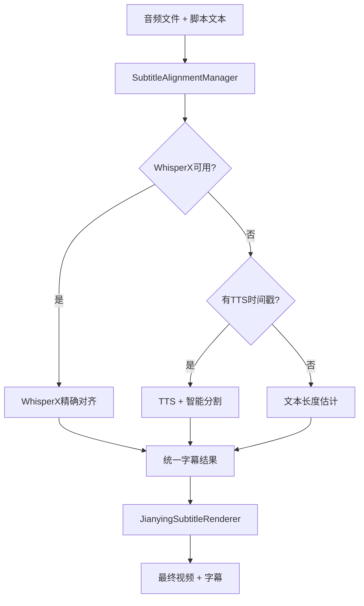

# 字幕系统架构说明

## 🏗️ 系统架构

重构后的字幕系统采用**统一管理器**模式，提供清晰的架构和多种对齐方案：

```
字幕系统/
├── subtitle_alignment_manager.py    # 统一字幕对齐管理器（核心）
├── subtitle_processor.py           # 基础字幕处理器（文本分割等）
├── jianying_subtitle_renderer.py   # 剪映风格字幕渲染器
├── whisper_alignment.py            # WhisperX精确对齐器（可选）
└── 其他字幕相关组件...
```

## 📋 核心组件

### 1. SubtitleAlignmentManager（核心管理器）
- **作用**: 统一管理多种字幕对齐方案
- **位置**: `video/subtitle_alignment_manager.py`
- **支持的对齐方案**:
  1. **WhisperX精确对齐** (优先级最高)
  2. **TTS时间戳+智能分割** (主要fallback)
  3. **文本长度估计对齐** (最后备选)

### 2. WhisperXAligner（可选组件）
- **作用**: 提供词级别精确时间戳对齐
- **位置**: `media/whisper_alignment.py`
- **特点**: 
  - 70x实时转录速度
  - 支持中文词级别对齐
  - 基于wav2vec 2.0强制对齐技术

### 3. SubtitleProcessor（基础处理器）
- **作用**: 文本智能分割、SRT生成等基础功能
- **位置**: `video/subtitle_processor.py`
- **核心功能**: 12字符/行智能分割、时间分配

### 4. JianyingSubtitleRenderer（视觉渲染器）
- **作用**: 剪映风格硬编码字幕渲染
- **位置**: `video/jianying_subtitle_renderer.py`
- **特点**: 半透明背景、白色字体、移动端优化

## 🔄 工作流程



## ⚙️ 配置参数

### WhisperX配置 (`config/settings.json`)
```json
{
  "whisperx": {
    "enabled": false,              // 是否启用WhisperX
    "model_size": "large-v3",      // 模型大小
    "device": "auto",              // 设备选择
    "language": "zh",              // 语言代码
    "batch_size": 16               // 批处理大小
  }
}
```

### 字幕配置
```json
{
  "subtitle": {
    "max_line_length": 12,          // 每行最大字符数
    "max_duration_per_subtitle": 3.0 // 每条字幕最大时长
  }
}
```

## 📊 对齐方案对比

| 方案 | 精度 | 速度 | 依赖 | 适用场景 |
|------|------|------|------|----------|
| WhisperX | 最高 | 快 | torch, whisperx | 生产环境，高质量要求 |
| TTS + 智能分割 | 中等 | 最快 | 无额外依赖 | 开发环境，快速原型 |
| 文本长度估计 | 较低 | 最快 | 无额外依赖 | 最后备选，兼容性优先 |

## 🔧 使用示例

### 基本使用
```python
from video.subtitle_alignment_manager import SubtitleAlignmentManager, AlignmentRequest

# 初始化管理器
manager = SubtitleAlignmentManager(config, file_manager)

# 创建对齐请求
request = AlignmentRequest(
    audio_file="audio.mp3",
    script_text="完整脚本文本",
    language="zh",
    max_chars_per_line=12
)

# 执行对齐
result = manager.align_subtitles(request)
print(f"使用方案: {result.method}")
print(f"生成字幕段数: {result.total_segments}")
```

### 高级用法
```python
# 获取对齐统计信息
stats = manager.get_alignment_stats(result)
print(f"置信度: {stats['confidence_score']}")
print(f"平均每段时长: {stats['avg_duration_per_segment']:.2f}s")

# 保存字幕文件
manager.save_alignment_result(result, "output.srt")

# 清理资源
manager.cleanup()
```

## 🚀 安装WhisperX（可选）

如果需要最高精度的字幕对齐，可以安装WhisperX：

```bash
# 安装WhisperX依赖
pip install -r requirements-whisperx.txt

# 启用WhisperX
# 在config/settings.json中设置 "whisperx.enabled": true
```

## 🎯 优势总结

1. **统一接口**: 一个管理器，多种方案，调用简单
2. **智能回退**: 自动选择最佳可用方案，无需手动处理
3. **高度可配置**: 支持多种参数调整，适应不同需求
4. **资源管理**: 自动清理模型缓存，内存使用优化
5. **调试友好**: 提供详细统计信息和调试文件
6. **架构清晰**: 各组件职责明确，便于维护和扩展

这个新架构大大简化了main.py的复杂性，同时提供了更强大和灵活的字幕处理能力。